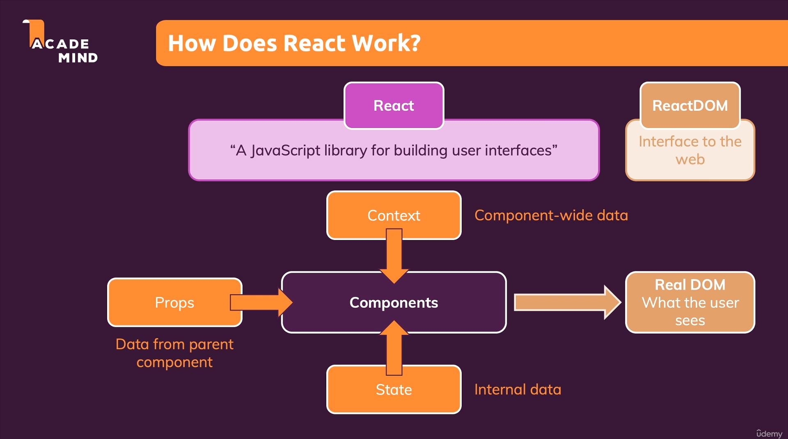
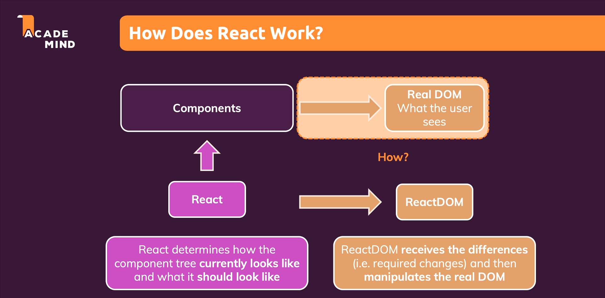
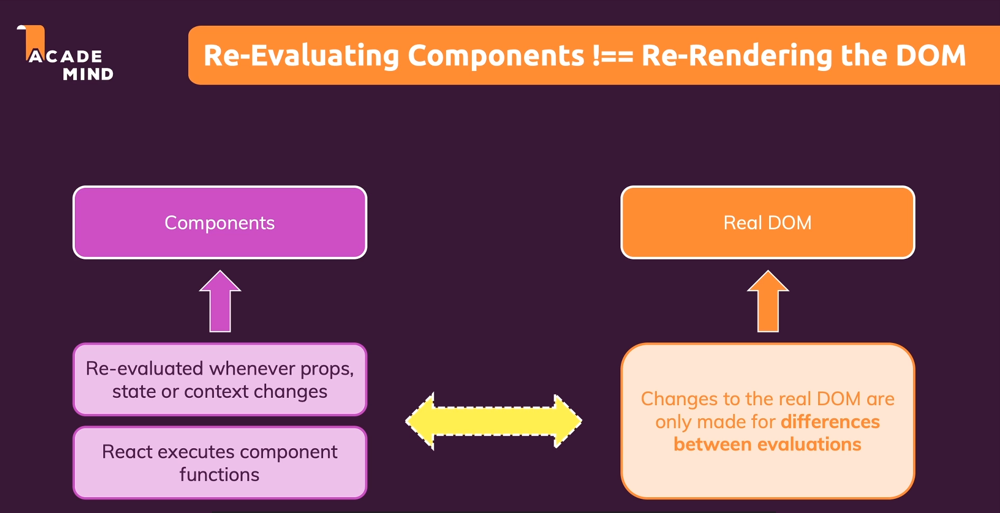
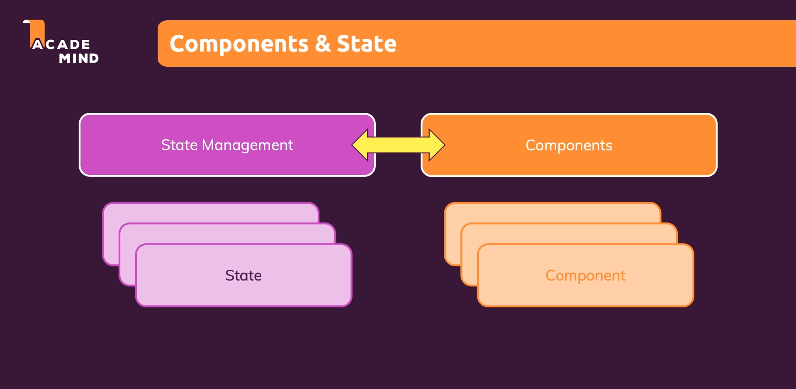

# Behind the scenes of react :

* React is a JavaScript library which only cares about the components and it doesn't care about the DOM and what the components are made up of.

* React DOM is a library which cares about the DOM and it's components.

* React mainly cares about props, state and context. And whenever these three change components which are dependent on them are updated and if these components are supposed to bring something new to the screen then react lets the react-dom know about these dom changes.

* 

* React uses a concept called virtual dom which determines how the component tree which our app builds in the end looks like and what it should like after state update.

* And that information is handed to reactDOM to manipulate the react dom.

* 

* 

* While re-rendering the component react only manipulates the part which is different from the previous snapshot.

* 

## Optimization of react components :

* React components are like functions so whenever the parent component is re-executed the child components are also rexecuted and it doesn't matter it the props change or not , if the parent is rexecuted , child will be rexecuted.

* However child component's revaluation doesn't mean that the dom will be manipulated.

*  This behavious is highly inefficient since a parent component can contain a lot of child components and revaluation of such all component will cost a lot of performance.

* This won't matter in smaller app but it does in bigger apps.

* To optimize the component to be revaluated only if the props change we wrap the export statement of the component in React.memo.
  
* This only works in function based components and not in class based components.

* This tells react to look at all the props this component gets and check the new values for this props and the component should be re-executed and re-evaluated only if the props change.

* The reason we don't do it to all the components is that such a behaviour has a cost, the memo function tells react that whenever the app components changes it should go to this component here and compare the new prop values to the previous prop values so therefore react needs to do two things it needs to store the prev props values and compare those values.

* And hence it depends on the components we are applying this to whether its worth it or not because we are trading the cost of revaluating the component for the performance cost of comparing props.

* We can use it in cases where our component tree has a lot of branches and we can prevent the revaluation of those branches by using this.

* But when we add the memo function to button , it still reloads. The reason is that we are passing a function as a prop to button and even though this button does not change in its function it changes when the parent component reloads.

* And when the parent component reloads a new copy of that function is created. But when the function reloads the a new false value is also created so the DemoOutput component should also reload.

* But it doesn't the reason being that js compares the prev with current values using ===. And primitive values give true for this operator even though they might be different but user-defined object , array or functions (functions in actual are objects) dont. 

## useCallback :

* We can make react memo work for prop values that are objects as well as arrays and we do that by using useCallback hook.

* useCallback allows us to store a function across component executions , so it allows us to tell react that we want to save a function and that this function should not be recreated with every executed. With that one in the same function object is stored so one in the same place in memory and therefore the comparision does work.

* useCallback store the same function somewhere in the internal memory and reuses the same function to pass to props.

* useCallback also requires a second argument which is an array of dependencies and dependecies here are the same as they are for useEffect.

* useCallback takes in dependencies so that in the function inside useCallback which is stored in the memory along with the values of all the external variable which cannot be changes. So to change them and change the functionality of function based on them we add it as a dependency.

## Components and state :

* Every state is associated with a component and react stores the initial and previous values of that state in the component. And hence it never loses that value.

* Only time when react re-initializes the state is when the component is completely removed.

* Same is true for useReducer.

* 

