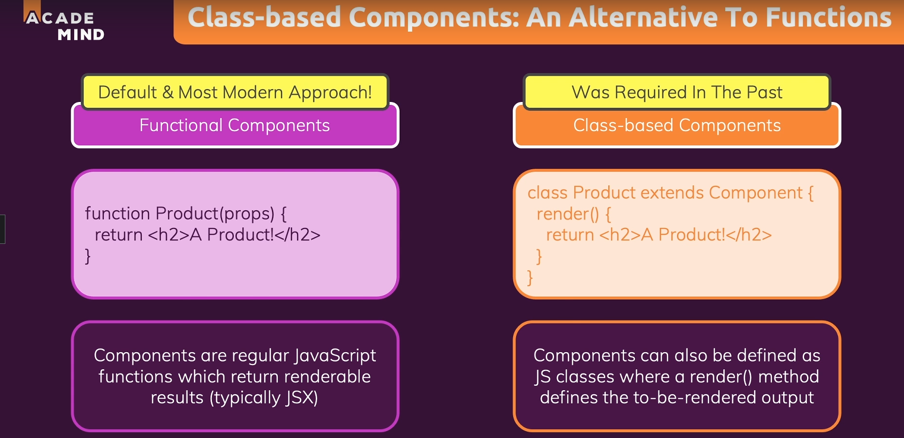
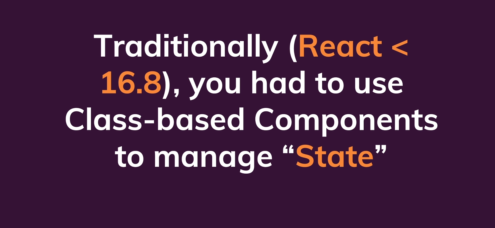
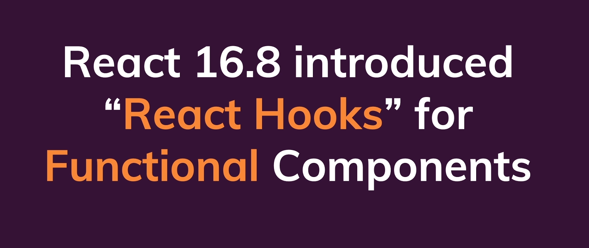
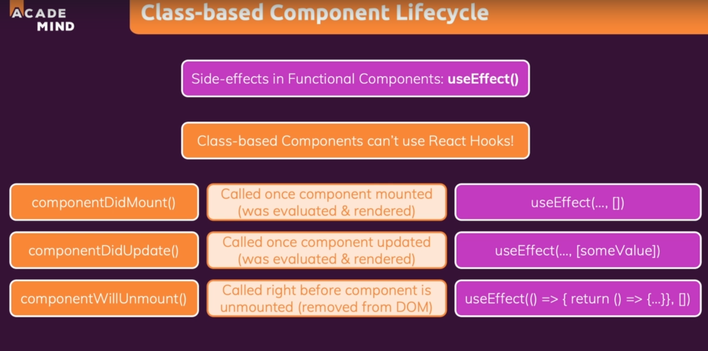
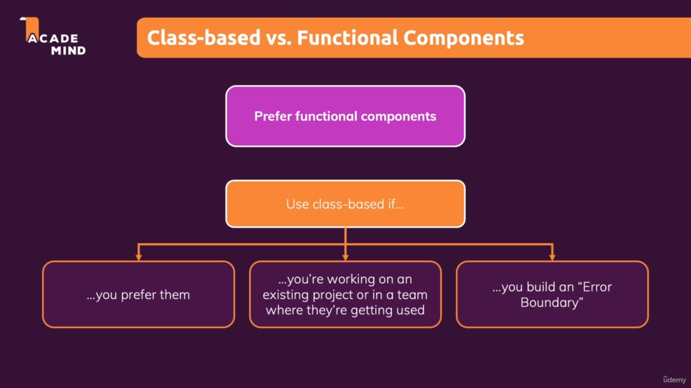

# Class based-components :

* Class based-components are an alternative way of defining components. But they will be used in the same way as the normal components.

* 

* 

* 

* Class-based components cannot use react hooks.

## States in class based components :

## Class-based components lifecycle :

* We can use useEffect hook to manage side effects in class-based components but class based components have a concept called component life-cycle.

* But ever component has a life-cycle but there are specific method which we can use to run code at specific lifecycle points.

* Most important we can use is the componentDidMount method. Like render it is an inbuilt method and it is called when the component was just mounted.

* 

* componentDidMount is equivalent to using useEffect with an empty array.

* componentDidUpdate is equivalent to using useEffect with some value becuase the component will be updated when the some state value changes.

* componentWillUnmount is called right before the component is removed from the DOM and and here the equivalent is basically the clean up function from use EFFECT that cleanup function is called right before the EFFECT function is executed again and also always again, when the component is about to be removed from the DOM.

## Summary of class vs function based components :

* 

## Error bounderies : 

* We can use errors in cases where we get errors for example when we get an error from the server.

* To handle such errors we throw them up the component tree. To deal with such errors we can use try-catch in normal js but not in react/jsx.

* In such cases we can build and utilize error bounderies.

* The idea behind error boundaries really is that we can ensure that not your entire application crashes if something goes wrong.

* But that instead you can catch those errors and then handle them in an elegant way, just as you would do it with try catch in regular JavaScript. And for error boundaries, if you add them, you need class-based components.

* This is currently not possible with functional components.

