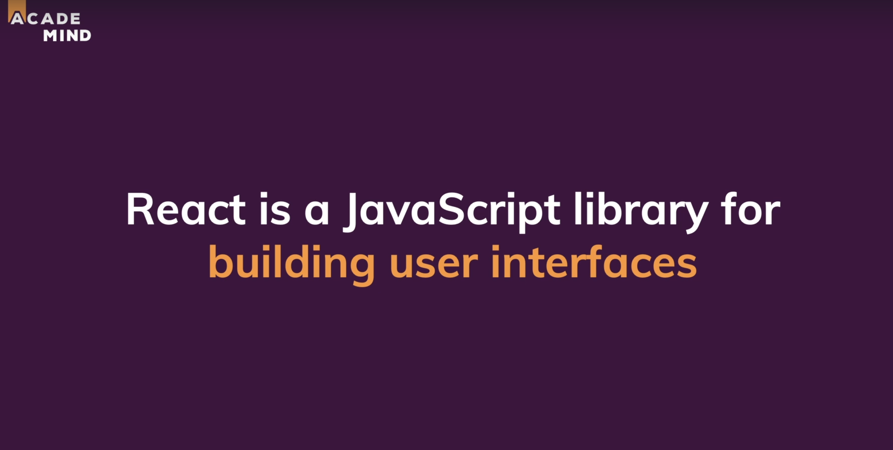
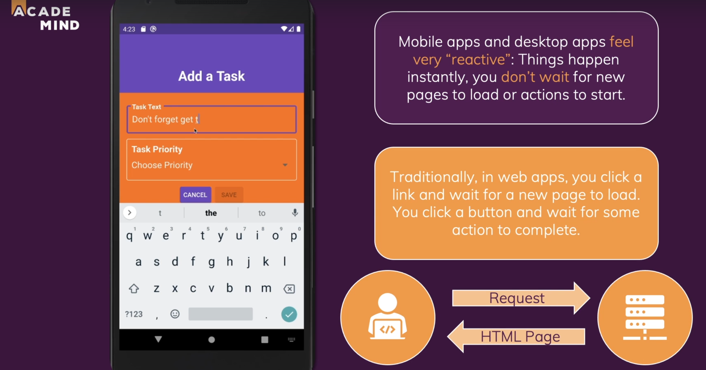
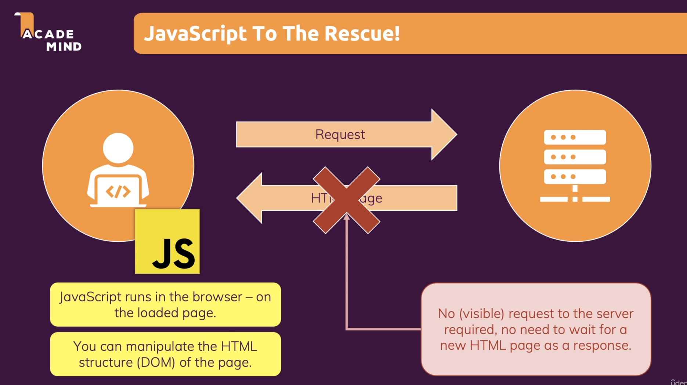
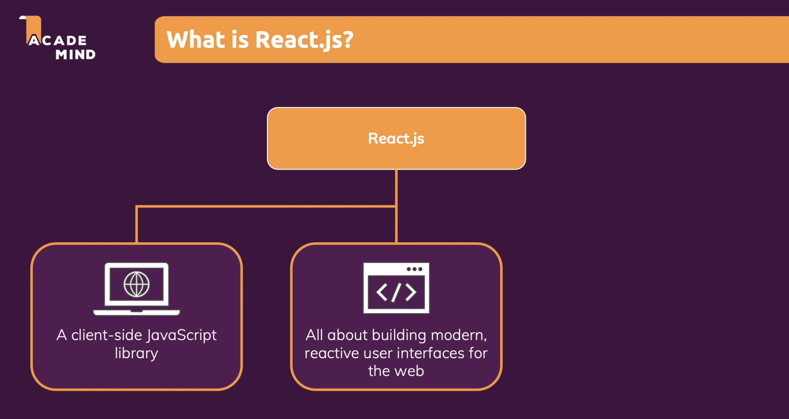
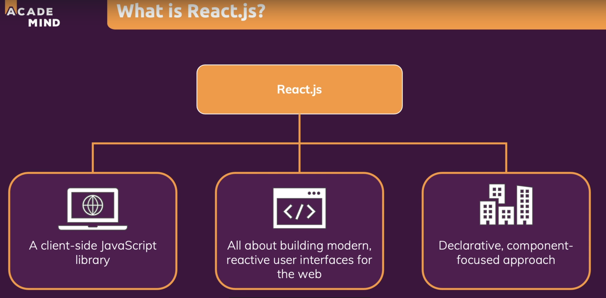
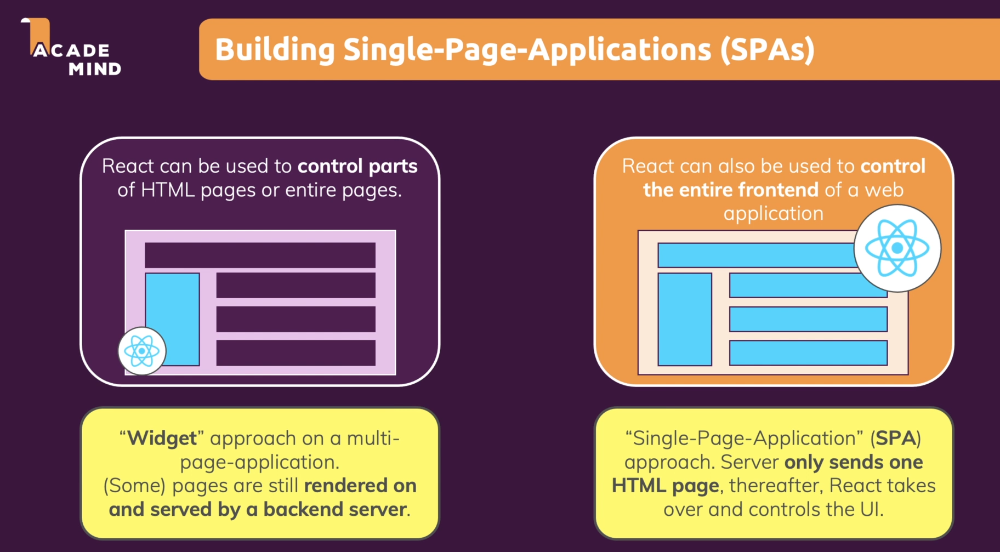
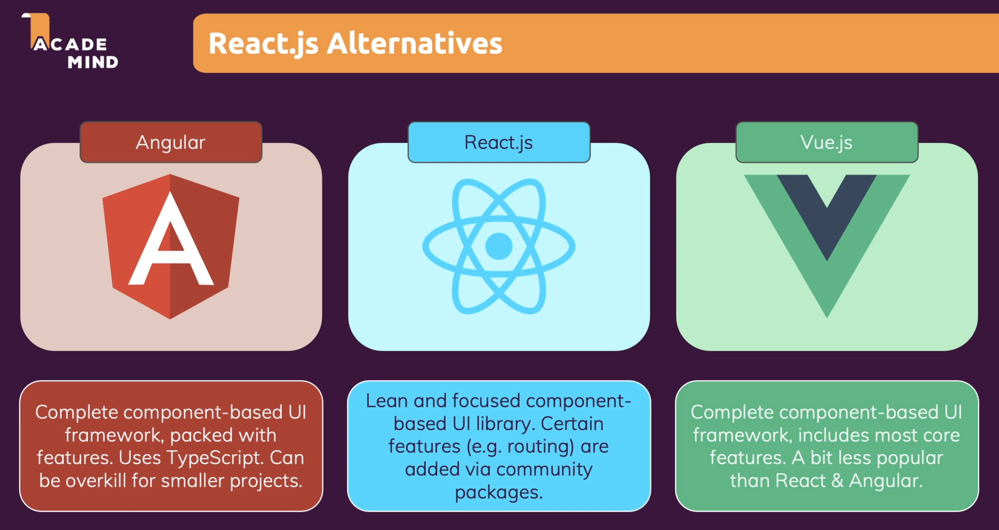

# React :

- 

- 

- We can break the request and html page response cycle by using simple js, by either using ajax or fetch api.

- JS allows us to run logic in the browser and it allows us to manipulate the DOM hence changing what the user sees without reloading the page.

- 

- 

- If we are to use vanilla js for every task we would have to add multiple click listeners to multiple elements and do this for every element in the DOM. This leads to a lot of redundant code. And we will have to perform the same task again and again in for different projects.

- So instead of doing this we can use React.js. Which allows us to split our application into small components , where every component has a clear task and therefore our code stays maitainable and manageable.

- React does all the heavy lifting of rendering something on the screen and of combining all our code.

- React code is not imperative, so we do not need to write the code line after line and in a specific order. Rather we can just write the code according to our needs and also alot of elements are predefined in the library. And these elements can be directly used in our code.

- So react allows us to work at a higher level which makes working with react much easier.

- 

- Also we do not need to write the same code again and again we can directly use the previously defined component.

- Since react allows us to easily build rich user interfaces , we usually build single page applications.

- 

## React alternatives :

- 
