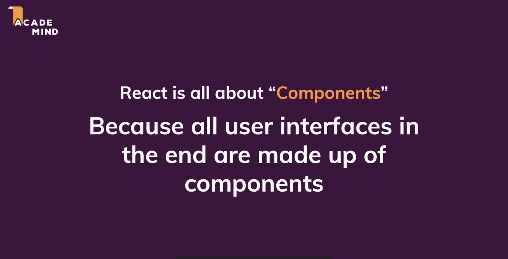

# React basics :

* In this module we will learn how to build component-driven user interfaces which are user interfaces which are built by embracing a concept called components which turns out is actually embraced by React. 

* React is used for making user interfaces but so are HTML,CSS and JS. But we use react because it makes building complex interactive and reactive user interfaces simpler.

* It much easier to build an app using react because we won't have to focus on all the nitty-gritty details and it will be less error prone if we use something like react because we will be able to focus on our core business logic that makes up our application.

* To make the work simple for us react embraces a concept called components.

* 

* Components are reusable building blocks in our user interface. They are in the end just a combination of HTML, CSS and JS.

* We build these individual components and then we tell react how to compose them together in a final user interface.

* 

* These concepts are not native to react rather they are used in every programming language through the use of functions.

* React takes the concept of function and converts it to the world of front-end web.

## Components :

* 

* We combine HTML, CSS and JS to make a component. Then we combine all these components to build the entire user interface.

* 

* React uses something which is called a declarative approach for building components, it basically means that with react we will not tell react that a certain HTML element should be created and inserted in a specific place on the user interface as we would be doing it will vanilla JS.

* Instead with react we will always define the desired end state, the target state or possibly also different target states. Then its reacts job to determine which elements actually need to be added or removed or updated on the page.

* We don't write concrete DOM manipulation code in our components, we just define the desired end state and under which condition which state will be used.

## Getting started with react application :

* The easiest way to get started with react is to use a tool called `create-react-app` which is a simple way to create a react application.

* It is tool we can use to create react projects which is basically preconfigured folders with some basic react code files and most importantly a bunch of configuration files which help us build that react app for production use.

* This project which is created using this tool will gives us a nice development environment with a development web server which allows us to preview our application in the browser locally and it is updated automatically on code change.

* For this tool we need node.js and npm for the development server and for other things.

* To create the react app run `npx create-react-app app-name` in the terminal.

## Working of react : 

* With react we build our own custom HTML elements.

* Considered a good practise to put new components in new files so that we have one file per component.

* We don't move the App.js file in the components folder since it plays a different role in our react app. It will be our root component which will be the entry point of our application. All other components will be children of this component.

* 

* It is a common convention to name our components in upper camel case.

## Components reusablity :

* We can make our components reusable by using parameters and a concept called props in react.

* 

* In the above example we have a situation in which a component displays some data but the data is present in App.js and this is good as this makes the component independent of any data that it needs to display.

* Components can't just use data stored in other components but we have a concept called props.

* Which allows us to pass data to the custom component by adding a attribute and inside of that compoment we can get access to these attributes which might have been set on our custom component.

* Just as HTML elements have attributes so do our react components. This concept is just called props in react components.

## Composition :

* Building user interfaces using components which in turn are built using components is called composition.

* We can use our custom component like a WRAPPER COMPONENT using children and className prop.

* Being able to use components as wrapper allows us to make the components less complex and more reusable.

* This is also a part of composition.

## JSX : 

* We are using react dom at many places but we are not using the package react anywhere and this is the case in all the modern react app which are built using create-react-app.

* In many older react projects we might see react being imported where jsx is used. Modern setup just do this by themselves.

* JSX codes is convert to methods which are called on the react object.

## Folder structure :

* We put all the UI related elements in a UI folder.

* We put a feature specific code in the folder of its respective feature.