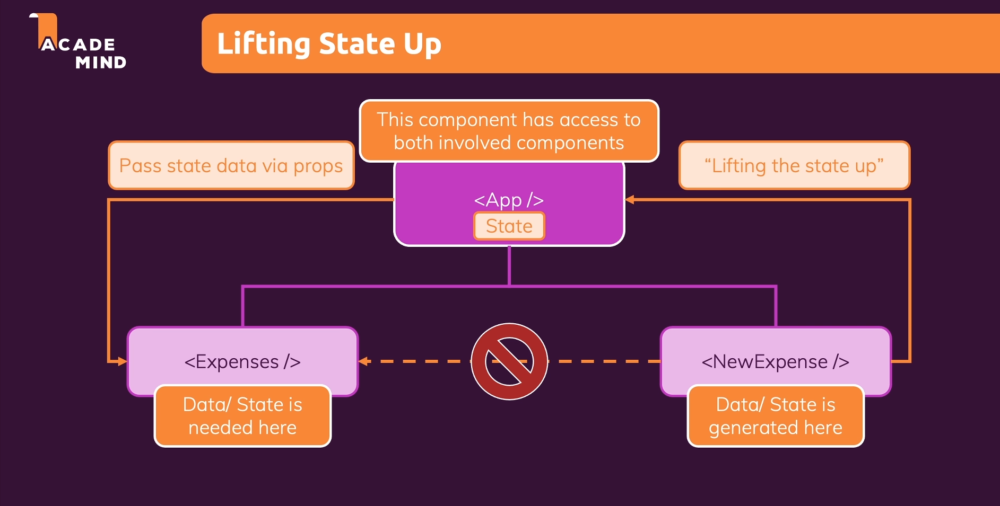

# React state : 

* Working of components in react : The components we define in react are nothing but functions and these function are called by react when it encounters them in the jsx code and react keeps on calling these function until there are no more functions left. And after it executes these function it draws whatever it found from the function calls on the screen.

* In react to add an event listener , instead of taking the imperative approach like in vanilla js we add an event listener by going to the JSX element and there we add a special prop. And this prop won't set a value for the element and it start with on.

* The problem with this is that it react never repeats the process of calling component functions and react only goes through this process when the application is initially rendered and thereafter its done.

* So we need a way of telling react that something changed and a certain component needs to be revaluated. And thats where react introduces state.

* To tell react to revaluated a component we import useState which is a function provided by the react library which allows us to define values as states and where changes to these values should reflect in the component function being called again.

* Then we simply call the useState in the component.

* This function is a react hook and there are other hooks as well.

* All the react hooks can be recognized by the use prefix and all these hooks must be called inside of the component function and outside of any nested functions.

* useState takes a default state value because with use State we create a special kind of variable, a variable where changes will lead to this component function being called again.

* And this function gives us the access to this special variable. However it does not just return that it also returns a function which we can then call to assign a new value to that variable.

* And hence useState actually returns an array where the first value is the variable itself and second element is the updating function. And we can use array destructuring to store those elements.

* And we can give them any name since in array destructuring only the order matters.

* UseState registers some state so some value as a state for the component instance for which it is being called.

* So it will only revalutate the component for which the update function is being executed.

* We update the value by calling the updating function returned by the useState hook.

* We set the new value like this because function not only assigns a new value to this variable but that it is a special variable and it is managed by react somewhere in memory and when we call this updating function , the special variable receives a new value and the component function in which we called and initialized the state will be executed again.

* And then react draws any new changes to the screen.

* Also calling this state update function won't update the value right away rather it schedules the update.

* So if we have a data which changes and for which we want to update the web page then we use state becuase a regular variable won't work.

* Also when the state is updated the component for which it is updated is revaluated and drawn on the screen. But the useState function won't be initialized again for that component and hence it will only return the value of state which we updated to and not that original value which was assigned initially.

## Multiple state vs single state :

* In react we can have multiple states in a component and have them update and manage seperately.

* But when our states are related we can also have them combined as a object of those different properties and when one changes the whole state is updated.

* It is upto us what we prefer.

## Two-way binding :

* We use state in our project instead of using global or local variables becuase we can use something called two-way binding which means that for inputs we dont just listen to changes we can also pass new values back into the input so that we can reset the input.

* So this is two way binding since we don't just listen to update events on the input we also feed the state back into the input so that when we change the state we also change the input.

* Two binding is very useful when we are dealing with forms because it allows us to gather user input and change the input fields.

## Child to parent communication component :

* If we want to pass form data from child to the parent component to display it in all the component list then we use the same pattern as we did in updating form input.

* We can pass a function from the parent to the child and then call that function in the child to pass data to the parent component.

## Lifting state up :

* 

* We can't directly transfer data from one component to its sibling component as we don't have a direct way of doing that. We can only communicate between parent to child and child to parent.

* So we utilize the closest parent component which has direct or indirect access to both child components.

* We are already doing this in the NewExpense component by passing the data received from the ExpenseForm and passing it to the app component.

* So this means to lift data from a child component and then either using it in the parent component or passing it to another child component. 

## Controlled component :

* Whenever we use two way binding we are controlling a component.

* So a value which is used in the component is passed on to the parent component and is received from the parent component. So both the currently set value and the function which handles the selected value is not part of that component.

* So such a component is only responsible for presenting the UI and then attaching a couple of listeners or props but the real logic recides in the parent component.

## Presentational/Stateless/Dumb vs Stateful/Smart component :

* It basically means that in react we have some components which handle states and some components which don't handle states. The ones which handle states are called stateful or smart components and the ones which don't handle states are called stateless or dumb or presentational components because it doesn't have any internal state and its just there to output some data.

* In most of the react apps we will have more stateless components than stateful components because we want to break our applications in small independent components and most pieces or most components will only focus on outputting some data.