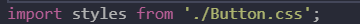

# Styling react components :

* Right now our css styles are not scoped to a particular component and would affect any element on the entire page with that css class.

## Setting styles dynamically :

* We add dynamic styles using states. And we set the inline-style by setting the style attribute equal to an object and in the object we target different css style properties.

* Another issue being that the inline styles have the highest priority and hence they override the css styles.

* Hence we need a better approach than inline styles.

* Another approach to this is to set a CSS class dynamically using backticks.

## Scoped styling :

* We can deal with non-scoped css styles by using different selectors for every component element but the issue with such an approach is that in large projects with multiple developers, it becomes difficult to maintain the styles.

* Following are ways to avoid this issue :

    1) Using styled-components : * We can use a package called styled-components which is a package that helps us build components which have certain styles attached to them where the styles only affect the component to which they were attached.

    * We install it using `npm i --s styled-components`.

* We can have a file having multiple styled components and then we use them as normal components.

* The good thing is that styled components forward all the props we set on them to the underlying components. Hence we can use this to dynamically set the classNames.

* So we can either set the classNames dynamically or use another feature provided by styled components which is that we can add props to our components and utelize those props where we set the styles by using props.attribute. For eg :

## Using CSS modules :

* If we like the seperation of css and js we can have a separate css file and then we can import it in our js file.

* We can stick to the initial approach of use global non scoped css.

* We can also use CSS modules.This is only available in projects which are already configured to support it and projects created by create react app are already configured to do so.

* To use css modules we change our css import statement to the following : 

* Also for the code transformation to take place we need to add .module in the file name. This basically tells react to make css modules work.

* Also we use style.classname to set the classname of the component we use.

* What css module does is changes the classname of the component under the hood to a classname that is unique to the component. And its format is componentName_className__someUniqueHash.

* For dynamic class names we use back ticks.