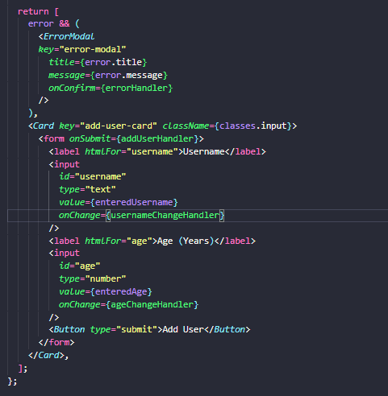

# Fragment, portals and refs:

## JSX Limitation:

- If we have two adjacent JSX root level elements we get an error.

- 

- The reason is that our JSX code get transformed to createElement function and only one function call can be returned.

- 

- Another solution is return an array of JSX elements. But we will need to provide a unique key to each element of the array as whenever we work with array react whats a key. 

- But we usually dont do that and we usually just wrap it in a div.

- But we might run into another problem of too many unnecessary divs which are only there because of this requirement or this limitation of JSX.

- 

- And we usually try to avoid rendering uneccessory elements.

- To overcome this we can use wrapper component which does nothing but just return the code written between it. So its an empty element who only function is to overcome this requirement.

- In the wrapper component we return the adjacent components and we wont get an error becuase we are returning it only through the wrapper component.

- Wrapper component won't render any real content.

- 

## Fragment :

* Since this approach is so obvious hence its include in react through fragments.

* 

* The left syntax will always work but the one on the right depends on our project configuration to work properly.

* If the `<></>` doesn't work we use `<Fragment>`

## React portals :

* Helps us write cleaner code.

* 

* The above way of writing code is not wrong but it not good code. And can lead to real problems because of styling and element access.

* And it in the above code our modal is deeply structured in our HTML code so its not obvious that this modal should be overlay to other html content.

* We have similiar problem for other overlays like side-drawer, pop-up, modal etc.

* 

* We can use a portal to write the component as we want to so that we have no friction when we want to pass data arround and so on. But to render modal differently in real dom and to render modal HTML somewhere else than it would normally go to.

* 

* And we can achieve this with react portals.

* Portals need two thing a place where we to port the component to and to let the component know to port to that place.

* To do that we create two extra roots next to root in our index.html.

* Then we seperate our overlay and backdrop elements into seperate components.

* Check the error modal to see the implementation.

* We use react-dom here which is library which brings all the react features to dom.

* On react dom we call the createPortal method which takes two arguments.

* First the react node which should be rendered in jsx code which allows us to access and use props to forward function.

* Second argument to createPortal is a pointer to the container in the real DOM where this element should be rendered in. And we use dom api to access the element.

