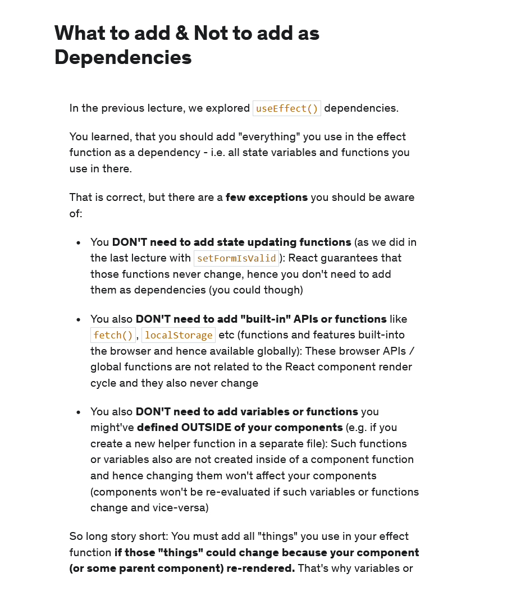
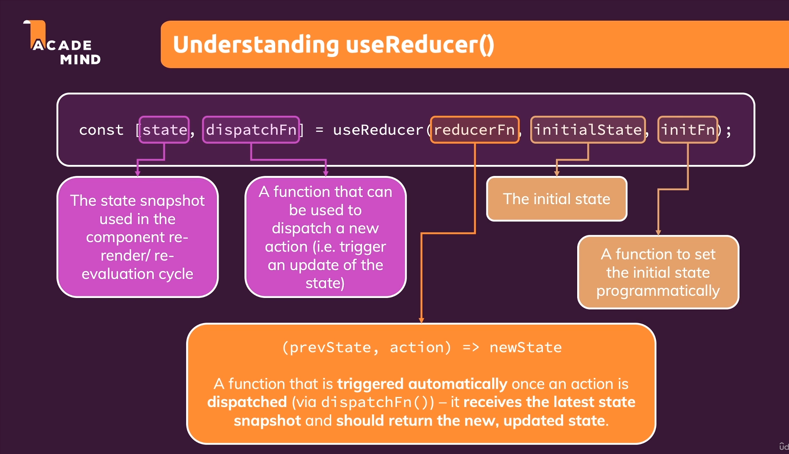

# Effects, reducers and context :

## Effect / Side-effect:

* 

* Side effect includes all the code which is not directly involved in rendering something on the screen.

* And we should not place this code in our component function since component function reevaulates every time there is a change in the state.

* For example if we wanted to send a HTTP request and if we were to send it in the component function then we would send the request whenever the function reevaulates.

* And if we were to change a state in response to our HTTP request then we would create an infinite loop.

* Therefore such side effects should not be placed in the component function since that would most likely create bugs, infinite loops or simply send too many HTTP requests.

* And we have a better tool for handling side-effects.

* 

* We use useEffect to handle side-effects.

* useEffect takes in a function and some dependencies. And it will only run the function if the dependencies have changed.

* 

* A useEffect hook with no dependencies (not even an empty array) will run every time the component reevaulates.

* But a useEffect hook with an empty array will only run the first time the component renders.

## Notes for the Login component's useEffect hook :

* Since we are using setFormIsValid , enteredEmail and enteredPassword in this function hence we should pass all these things as dependencies.

* And this effect function will be evaluated when one of the dependencies changes.

* Also since the state updated function are ensured by react to never change we do not need to pass then in useEffect.

* So we use useEffect to run some code when some data changes.

* So useEffect is hook which is used to execute code in response to something and that something could be the component being loaded, email address being updated or any action which happens in response to another action then that is a side effect.

* The above is being called on every keystroke in cases when we are making HTTP request that might lead a lot of unecessary trafic and hence we only want to check the input only when the user pauses.

* That is technique which is called debouncing , we want to debounce the input and to make sure that we are not doing something on every keystroke but once the user pauses.

* So for this we use a timer and call the setTimeout function. But we do not call it everytime.

* We save this timeout function and if this function is called again before the previous timeout executes we cancel the previous time out and create a new one.

* Implement our logic we will return something from the useEffect function and we can only return a function from the useEffect hook.

* And this function is known as a cleanup function and this function will run a cleanup process before useEffect runs next time (so not for the first time this function runs) and also before the component is removed.

* So we clear the clearTimeout function in the cleanup code.

* So using debouncing we reduce the number of times the useEffect function runs.

* A useEffect hook with no dependencies (not even an empty array) will run every time the component reevaulates.

* But a useEffect hook with an empty array will only run the first time the component renders.

* If we set no dependencies in useEffect the function inside it will be called every time the code runs.

* Equivalent to putting it just in the component function.

## useReducer:

* Hook which helps us to manage the state of our application.

* 

* 

* Another problem with updating the state in this way is that we are updating the state using another state and we should not do this because react schedules state updates and our state might me outdate by the time we use it.

* NEVER UPDATE A STATE USING ANOTHER STATE.

* So we use useReducer to manage the state and combine the multiple states into one state.

*  

* useReducer also returns an array to us and the first element in the array is the state and second element is the dispatch function.

* dispatch function will help us update our statue but instead of setting a new state value it allows us to dispatch an action and the action will be consumed by the reducer function.

* We use the dispatch function to call the reducer function which get the previous state and the action and returns the new updated state.

* We can also set the initial state or use a initial function to do so if our state is complex.

## useState vs useReducer:

* 

* There is no hard rule and we can certainly handle cases where useReducer will be good with useEffect and useState.

* On the other hand we should not always use useReducer because often that will be overkill if we have a simple state and using it might be overkill.

## Context API :

* Another problem we might face in a lot of react app is when we are passing a lot of data using props.

* Also there are many cases in which we just pass in some data to a component to just forward it to another component and in bigger apps this chain of forwarding can get very long.

* 

* Above is an example of a chain of forwarding.

* 

* We have a component wide behind the scenes state storage built into react , we have a concept called react context and this allows us to trigger an action in the component wide state storage and then directly pass that to the component that is interested without building forwarding chains.

* So first we provide this context by adding the provider in the parent components.

* Secondly we have the listening part , to get access to our value and we can do that in two ways :
    1) By using auth-context consumer.

    2) By using react-hook.

* Using auth-context consumer :
    * Consumer take in a function and it will give the value of the context as an argument.

    * And in that function we should return our JSX code which should have access to the data. We use our context object in this JSX code to access the component wide state storage.

    * 

    * 

    * But if we do so we get an error the reason being that we do have an default value in our auth-context but that default value will only be consumed if we consume it without having a provider.

    * But we use context for values which can change but that is only possible with a provider.

    * To make it work we pass in a value prop to the provider and we pass in the default value. And now we can change our provider with the new value being passed down every component that is listening to the context.

    * 

* Using the useContext hook:

    * Allow us to use the context.

    * We call the function and pass in the pointer to the context we want to use.

    * And we get back the context object.

* We can also pass function using the context.

* The component in which we directly use the data we still use props.

* In most cases we use props to pass in data to a component. We only use context only when there are multiple components that are just forwarding the data to another component.

* Also we can move all the code related managing in the loggedIn state along with the login and logout functions to the context and then wrap our App component in the new AuthContextProvider component wee build in the auth-context file.

* And we have central place for state management which is the auth-context file.

## React context limitations:

* 

## Rules of Hooks :

* We are only allowed to use hooks in the function component or custom hooks.

* We are only allowed to use hooks in top level of the component function. Not inside a callback or a nested function.

* Add anything we use inside a useEffect as a dependency. One exception to this rule is that we should not add the state updating functions of useState or useReducer as dependencies since they are guaranteed by react to never change.

* 

## useImperativeHandle hook : 

* We use the useImperativeHandle hook which allows us to use this component or functionalities from inside this component imperatively which simply means that not through the regular state props management but by directly calling something in the component programatically.

* Simply defined we cannot call function defined inside a component using refs without using the useImperativeHandle hook.

* For the component for which we want to call the function on we add the useImperativeHandle hook to the component.

* We call useImperativeHandle and pass two parameters to it.

* First argument is something we get from the component argument list (next to props) which is a ref. 

* This ref is set from outside and to make sure that this ref can be set and is also available we need to wrap it in React.forwardRef.

* Forward ref takes in a reaction component function and returns a component which is capable of being bound to a ref.

* Second parameter is function which returns an object which contains all the field we want to access from outside the function.

* 

* We will only be able to call the function we expose in the useImperativeHandle hook.

* 